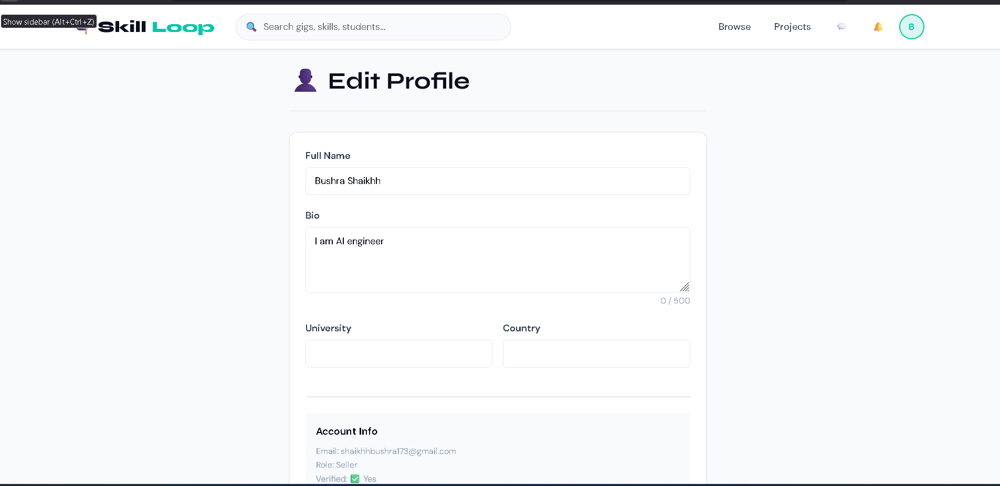

# SkillLoop
# 🎓 SkillLoop — Global Student Skill Marketplace

> A full-stack web application where university students worldwide can offer, 
> discover, and exchange skills using Campus Coins (virtual currency) or Skill Swap.

---

## 📌 Overview

SkillLoop is a student-exclusive freelance marketplace built as part of a 
Software Architecture & Design course. It demonstrates real-world application 
of 5 Gang of Four design patterns within a clean MVC architecture using 
Python Flask, SQL Server, and Flask-SocketIO.

Think of it as **Fiverr — but built specifically for university students**, 
with a virtual currency system, skill swapping, real-time chat, and a 
project bidding marketplace.

---

## ✨ Features

- 🎓 **Student Verification** — OTP email verification + educational domain check (.edu, .ac.pk)
- 🛍 **Gig Marketplace** — Create, browse, and order skill-based gigs
- 💰 **Campus Coins** — Virtual currency with escrow system
- 🔄 **Skill Swap** — Exchange skills without money
- 📱 **Mobile Payments** — EasyPaisa and JazzCash integration
- 💬 **Real-time Chat** — WebSocket chat per order via Flask-SocketIO
- 📋 **Project Bidding** — Post projects and receive bids from sellers
- 🔔 **Live Notifications** — Real-time event-driven notification system
- 👤 **Role-based Dashboards** — Separate views for Buyer, Seller, and Both
- 🛡 **Admin Panel** — User management, gig moderation, and analytics
- 🌐 **Google OAuth** — Login with Google account

---

---

## 🏗 Architecture

SkillLoop follows a **5-Layer MVC Architecture**:

